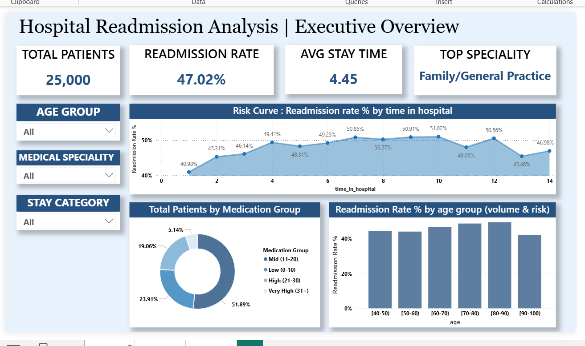
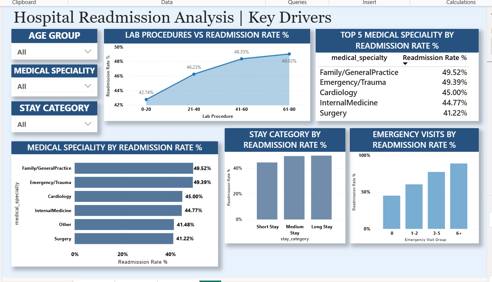
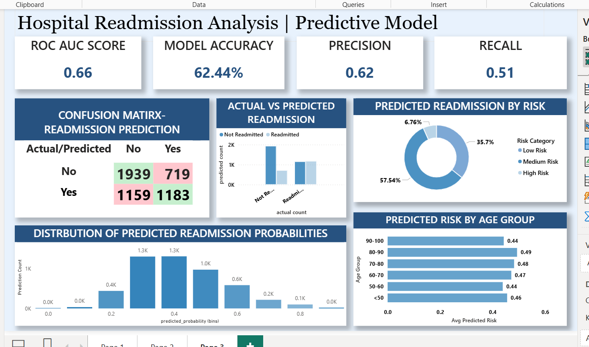

# Hospital Readmission Prediction & Healthcare Analytics

An end-to-end healthcare analytics project combining **SQL data preparation, machine learning, and Power BI** to analyze patient readmission patterns and predict readmission risk.

---

## Project Overview

Hospital readmissions are a major challenge for healthcare systems because they increase costs and may indicate gaps in patient care.

This project analyzes patient demographics, clinical factors, hospital stays, medication usage, and previous visits to identify patterns associated with readmission.

The workflow combines **PostgreSQL, Python, Scikit-learn, and Power BI**, resulting in a three-page interactive dashboard covering executive insights, clinical patterns, and predictive model performance.

---

## Dashboard Preview

### Page 1 — Executive Overview

Provides a high-level view of patient demographics, readmission rates, hospital stays, and key clinical indicators.



### Page 2 — Clinical Insights

Explores clinical and demographic patterns associated with hospital readmissions.



### Page 3 — Predictive Model Analysis

Presents model performance metrics, confusion matrix analysis, prediction probabilities, and patient risk patterns.



**[View Power BI Dashboard File](dashboard/HOSPITAL_READMISSION.pbix)**

---

## Project Workflow

### 1. SQL — Data Preparation & Feature Engineering

The raw healthcare data was analyzed and prepared using **PostgreSQL**, including table joins, missing-value handling, aggregation, and feature engineering.

Key features included:

* `stay_duration` — Hospital stay duration
* `medication_count` — Total medications administered
* `prior_visits` — Previous hospital visits
* `emergency_visits` — Emergency visits during the previous year

### 2. Python — EDA & Machine Learning

Data exploration and modeling were performed in **Google Colab** using **Pandas, Scikit-learn, and Matplotlib**.

The workflow covered preprocessing, feature exploration, train/test splitting, model training, and evaluation.

### 3. Model Evaluation

| Metric    |  Value |
| --------- | -----: |
| ROC-AUC   |   0.66 |
| Accuracy  | 62.44% |
| Precision |   0.62 |
| Recall    |   0.51 |

A confusion matrix was also used to evaluate true and false predictions.

---

## Power BI Dashboard

The final results were integrated into a **three-page interactive Power BI dashboard**.

**Executive Overview**

* Total patients analyzed
* Overall readmission rate
* Average hospital stay duration
* Readmission trends by length of stay
* Medication distribution
* Readmission rate by age group

**Clinical Insights**

* Age-group distribution
* Specialty-based readmission trends
* Medication intensity
* Hospital stay impact on readmission risk

**Predictive Model Analysis**

* ROC-AUC, precision, and recall
* Confusion matrix
* Predicted readmission risk distribution
* Prediction probabilities
* Predicted risk by patient age group

---

## Key Insights

* Patients with multiple emergency visits show higher readmission risk.
* Longer hospital stays are associated with increased probability of readmission.
* Older age groups show slightly elevated predicted risk levels.
* The majority of patients fall into the medium-risk prediction category.

---

## Tools & Technologies

**PostgreSQL** · **Python** · **Pandas** · **Scikit-learn** · **Matplotlib** · **Power BI** · **Google Colab**

---

## Repository Structure

```text
Hospital-readmission-analysis-/
│
├── data/
│   ├── raw/
│   │   └── hospital_readmissions.csv
│   │
│   └── processed/
│       ├── processed_hospital_data.csv
│       └── powerbi_readmission_predictions.csv
│
├── sql/
│   └── hospital_readmission_sql.sql
│
├── notebook/
│   └── readmission_model_pipeline.ipynb
│
├── dashboard/
│   └── HOSPITAL_READMISSION.pbix
│
├── screenshots/
│   ├── page1_screenshot.png
│   ├── page2_screenshot.png
│   └── page3_screenshot.png
│
└── README.md
```
